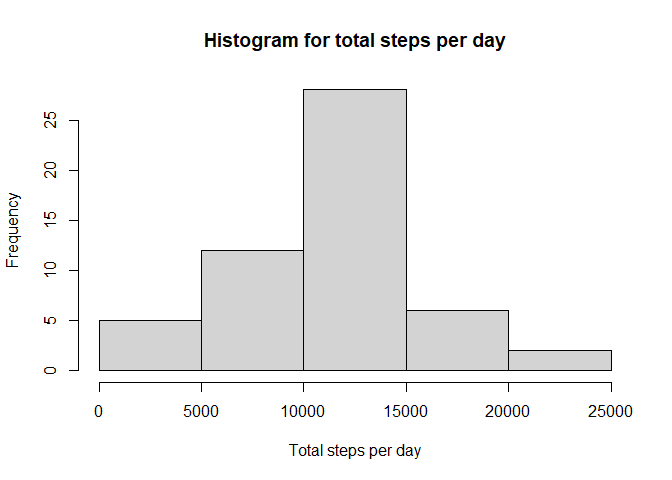
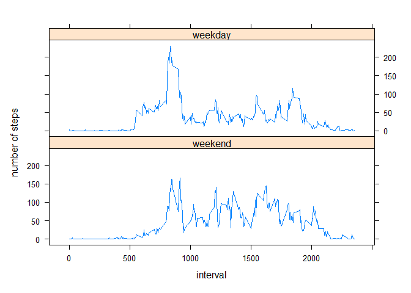

1. Code for reading in the dataset and/or processing the data

```r
df = read.csv("activity.csv",na.strings = "NA")
df$date = as.Date(df$date,'%Y-%m-%d')
dfna = df[!is.na(df[['steps']]),]
```

2. Histogram of the total number of steps taken each day

```r
totalsteps = aggregate(steps~date,data=dfna,FUN= sum)
hist(totalsteps$steps, main='Histogram for total steps per day',xlab='Total steps per day')
```

<!-- -->

3. Mean and median number of steps taken each day

```r
totalmean = mean(totalsteps$steps)
totalmedian = median(totalsteps$steps)
totalmean
```

```
## [1] 10766.19
```

```r
totalmedian
```

```
## [1] 10765
```

4. Time series plot of the average number of steps taken

```r
intervals = aggregate(steps~interval,data=dfna,mean)
plot(intervals$interval,intervals$steps,type='l', xlab='intervals',ylab='steps',main='Interval vs steps')
```

<!-- -->

5. The 5-minute interval that, on average, contains the maximum number of steps

```r
maxsteps = which(intervals==max(intervals$steps),arr.ind=T)
maxsteps
```

```
##      row col
## [1,] 104   2
```

6. Code to describe and show a strategy for imputing missing data  
In this case, we will fit the data with average steps from interval

```r
fillna = df
for (i in 1:nrow(fillna)) {
  if (is.na(fillna[i,1])) {
    fillna[i,1] = intervals[intervals$interval==fillna[i,3],2]
  }
}
```

7. Histogram of the total number of steps taken each day after missing values are imputed

```r
hist(fillna$steps,main='Histogram for total steps per day (predicted)',xlab='Total steps per day')
```

<!-- -->

8. Panel plot comparing the average number of steps taken per 5-minute interval across weekdays and weekends

```r
weekday = c('Monday', 'Tuesday','Wednesday','Thursday','Friday')
weekend = c('Saturday', 'Sunday')
fillna$day = weekdays(fillna$date)
#factorize in weekday or weekend
fillna$day = factor(fillna$day %in% weekday,levels=c(FALSE,TRUE),labels=c('weekend','weekday'))
wwpat = aggregate(steps~interval + day, fillna,mean)
library(lattice)
```

```
## Warning: package 'lattice' was built under R version 4.1.2
```

```r
xyplot(steps~interval|day,type='l',wwpat, layout=c(1,2),ylab='number of steps')
```

<!-- -->
